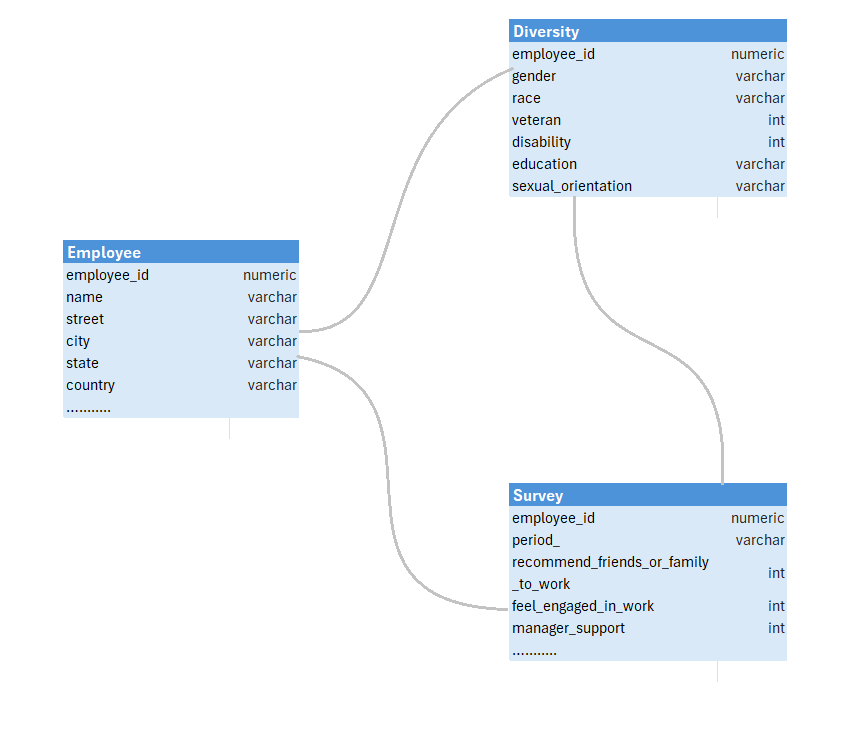
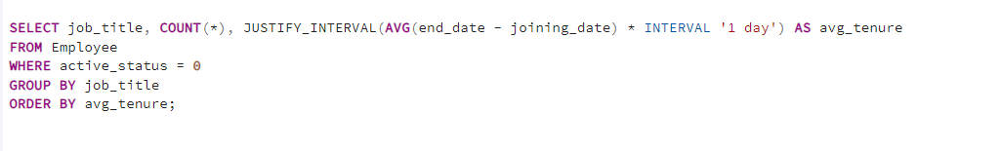
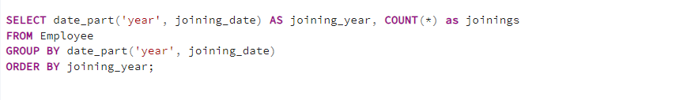
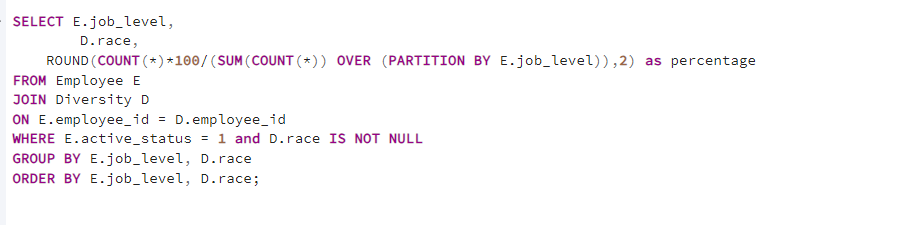
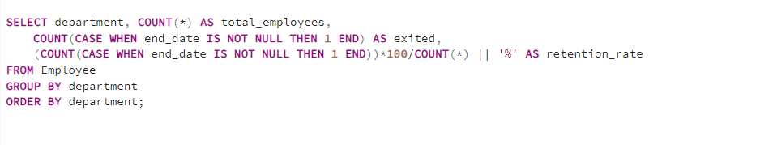

# Employee-Insights-and-HR-Analytics

## Project Overview
This project involves SQL-based analysis of employee data from an organization spanning from 2009 to 2022, focusing on key workforce dynamics such as retention rates, demographic distributions, and employee surveys. 
The project offers an examination of employee data through structured SQL analyses complemented by dynamic ad-hoc queries. The queries highlight key HR metrics across the employee lifecycle, including joining and exit trends, salary distributions, retention rates across different age groups and job levels, as well as employee feedback. The project aims to addresses employee turnover by analyzing retention rates and utilizing employee survey data to assess overall satisfaction and engagement.

## Database Description
The database consists of three tables:

__Employee__: Contains information about employees, including their ID, joining date, job title, exit date, and other relevant details.

__Diversity__: Contains demographic information about employees, such as race, gender, and other diversity-related data.

__Survey__: Contains survey responses from active employees within the organization.

## Data Structure

## Tools and Technologies  
- __Query Language:__ SQL
- __Database Management System:__ PostgreSQL

## Key Features of the project

__1. Active Workforce Analysis:__
- Determines the number of active employees in the organization.

__2. Joining and Exit Trends:__
- Identifies peak joining dates and months.
- Analyzes the number of exits per month.

__3. Yearly Hiring Trends:__
- Examines hiring patterns over the years.

__4. Salary Insights:__
- Calculates average salaries by country and job level to assess pay equity and market competitiveness.

__5. Workforce Diversity Analysis:__
- Shows the percentage of active employees by education level.
- Provides insights into workforce composition.

__6. Departmental Breakdown:__
- Highlights the total number of employees per department and their proportional representation.

__7. Retention and Exit Analysis:__
- Computes retention rates across age groups.
- Analyzes average tenure of exited employees by age group.

## SQL Techniques Demonstrated
- __JUSTIFY_INTERVAL, AVG, COUNT, GROUP BY, ORDER BY.__
  
- __date_part, COUNT, GROUP BY, ORDER BY.__
  
- __JOIN, window functions, PARTITION BY, percentage calculation.__
  
- __CASE WHEN, conditional aggregation, retention rate, GROUP BY.__
  

## Conclusion
This project highlights SQL expertise by combining the analysis of employee data with survey feedback to gain insights into organizational dynamics. It provides a detailed view of retention patterns and their causes, identifies diversity gaps, and evaluates employee engagement through survey data to upport decision-making for organizational improvement.
